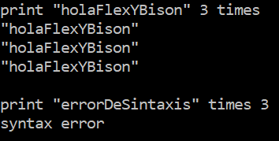
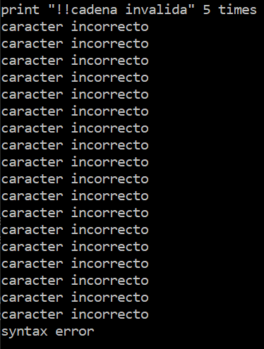
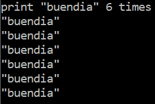

# Loop "for" en Flex-Bison

Implementación muy reducida de un bucle "for" alternativo.  

## Funcionamiento y sintaxis   

```print CADENA NUMERO times```  

## Expresiones regulares  

- CADENA: `\"[a-zA-Z]*\"` (cualquier cantidad de letras mayúsculas y minúsculas entre comillas dobles)
- NUMERO: `[1-9][0-9]*` (cualquier número entero que no empiece con 0)

Para probar las ERs, ejecutar estos comandos para generar el ejecutable ERtest:  

```
flex ERtest.l
gcc lex.yy.c -o ERtest
```

## Ejemplos  

  
  
  

## Compilar  

Ejecutar el batchfile `compilar.bat`, o bien ejecutar estos comandos en la terminal:  

```
flex for.l  
bison -yd for.y  
gcc lex.yy.c y.tab.c -o forloop  
```

Reemplazar `forloop` por cualquier nombre para el ejecutable.